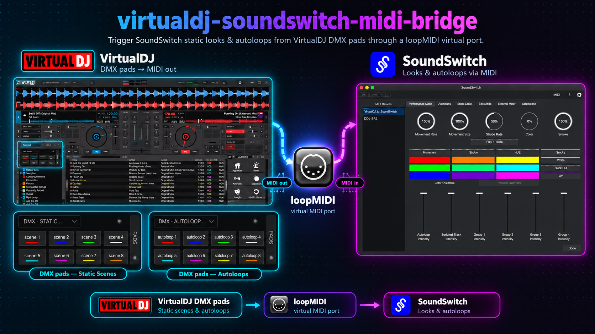

# VirtualDJ → SoundSwitch MIDI Bridge



Trigger SoundSwitch static looks and autoloops from VirtualDJ pads, over a
plain virtual MIDI cable. Includes 2 ready-made pad pages (8 static looks and
8 autoloops), plus an optional example of extending a physical controller
button (DDJ-SR2 Loop Param) to also send MIDI.

## What's in here

```
vdj-files/
  Devices/loopMidi 1.xml              the virtual MIDI device definition
  Mappers/loopMidi1_mapper.xml        translates variable changes into MIDI notes
  Pads/DMX - Static Scenes.xml        8 pads for SoundSwitch static looks
  Pads/DMX - Autoloops.xml            8 pads for SoundSwitch autoloops
ddj-sr2-bonus/
  Pioneer DDJ-SR2 - Custom Mapping.xml   example: a hardware button also sending MIDI
tools/
  midimon.ps1                         listens on the MIDI port, prints what arrives
  midisend.ps1                        sends test MIDI notes on demand
  install.ps1                         copies vdj-files/ into your VirtualDJ folder
```

---

## Easy way: use Claude Code

Install [Claude Code](https://claude.com/product/claude-code), open it in this
repo's folder, and paste in the prompt below. Claude will do the setup for you.

Here's a prompt to get Claude to do it for you:

```
Set up this repo so my VirtualDJ pads can trigger SoundSwitch lighting
scenes and autoloops over MIDI. Read README.md first so you know how it works.

Do it in this order:

1. Find my VirtualDJ data folder (usually %LOCALAPPDATA%\VirtualDJ). Tell me
   the path you found.
2. Check whether loopMIDI is installed and has a port named exactly
   "VirtualDJ_to_SoundSwitch" (case-sensitive). If it doesn't, tell me how to
   install loopMIDI and create the port.
3. Copy everything in vdj-files/ into the matching Devices, Mappers and Pads
   folders. If a file with the same name already exists, back it up first.
4. Tell me what to click in VirtualDJ (Settings > Controllers) so the
   loopMidi1_mapper is assigned to the VirtualDJ_to_SoundSwitch device, and
   how to put the "DMX - Static Scenes" and "DMX - Autoloops" pad pages on
   a deck.
5. Run tools/midimon.ps1 and have me press one pad in VirtualDJ. Confirm a
   Note On/Off really comes through. If nothing arrives, help me fix it
   before moving on.
6. Walk me through enabling VirtualDJ_to_SoundSwitch as a MIDI input in
   SoundSwitch and MIDI-learning pad 1 onto a static look and one autoloop
   pad onto an autoloop. Then I'll do the other pads myself.

Don't make up VirtualDJ script actions. If you're not sure about one, check
the files in this repo.
```

## Script way

`tools/install.ps1` copies the files from `vdj-files/` into your VirtualDJ
folder. It's about 25 lines. **Read it before you run it.** You should do
that with any script from the internet, including this one. It only
copies files. If any of them already exist it copies nothing and lists
them instead, unless you add `-Force`.

```powershell
cd tools
.\install.ps1                                   # uses %LOCALAPPDATA%\VirtualDJ
.\install.ps1 -VdjFolder "D:\My VirtualDJ"       # if yours is somewhere else
```

It doesn't install loopMIDI or change any settings. After it finishes, do
steps 1 and 3–7 from the manual guide below.

## Manual way (step by step)

**Step 1: Install loopMIDI and create the port**
1. Download and install [loopMIDI](https://www.tobias-erichsen.de/software/loopmidi.html).
2. Open it, type `VirtualDJ_to_SoundSwitch` in the "New port-name" box, and
   click **+**. The name has to match exactly, including capital letters,
   because the device file is hard-wired to it.
3. Leave loopMIDI running. The port only exists while it's open.

**Step 2: Copy the files into VirtualDJ**

Open your VirtualDJ folder (paste `%LOCALAPPDATA%\VirtualDJ` into File
Explorer's address bar) and copy:

| From this repo | Into |
|---|---|
| `vdj-files/Devices/loopMidi 1.xml` | `VirtualDJ\Devices\` |
| `vdj-files/Mappers/loopMidi1_mapper.xml` | `VirtualDJ\Mappers\` |
| both files in `vdj-files/Pads/` | `VirtualDJ\Pads\` |

If Windows asks to replace a file, back up the old one first.

**Step 3: Check the controller in VirtualDJ**
1. Start (or restart) VirtualDJ.
2. Go to **Settings → Controllers**.
3. `VirtualDJ_to_SoundSwitch` should be in the list with `loopMidi1_mapper`
   selected. If it isn't selected, pick it from the dropdown.

**Step 4: Show the pads**
1. On a deck's pad panel, open the pad-page dropdown.
2. Pick `DMX - Static Scenes` for static looks, or `DMX - Autoloops` for
   autoloops.

**Step 5: Test that MIDI is coming out**

Do this before you open SoundSwitch, so you know VirtualDJ is working.
1. Open PowerShell in the `tools/` folder and run `.\midimon.ps1`.
2. Press a pad in VirtualDJ.
3. You should see a `NoteOn` line followed by a `NoteOff` line. If nothing
   shows up, go back over steps 1–4. The problem is on the VirtualDJ side.

**Step 6: Turn on the MIDI input in SoundSwitch**

In SoundSwitch's MIDI settings, enable `VirtualDJ_to_SoundSwitch` as an
input device.

**Step 7: Map each pad**
1. In SoundSwitch, open the **Static Looks** tab and right-click a look to
   start MIDI Learn.
2. Press the pad you want for it on the `DMX - Static Scenes` page in
   VirtualDJ.
3. Check that SoundSwitch has learned it (the look stops blinking).
4. Do the same in the **Autoloops** tab, using the `DMX - Autoloops` pads.
5. Repeat for as many of the 16 pads as you want.

**Step 8 (optional, DDJ-SR2 only)**

If you want a hardware button to fire MIDI too, see the
[bonus section](#bonus-hardware-button--midi-ddj-sr2-example) below.

### Note/value reference (all on MIDI channel 1)

| Note (dec) | Note (hex) | Value | Pads |
|---|---|---|---|
| 0–7 | `0x00`–`0x07` | `01001`–`01008` | `DMX - Static Scenes` pads 1–8 (static looks) |
| 8–15 | `0x08`–`0x0F` | `01009`–`01016` | `DMX - Autoloops` pads 1–8 (autoloops) |
| 32–33 | `0x20`–`0x21` | `01033`–`01034` | DDJ-SR2 bonus buttons (optional) |

Adding more pads just means adding more `<led>` lines to the device file
and matching `<map>` lines to the mapper, continuing the numbering from
`0x10` / `01017`.

## Bonus: hardware button → MIDI (DDJ-SR2 example)

`ddj-sr2-bonus/Pioneer DDJ-SR2 - Custom Mapping.xml` is VirtualDJ's full
stock DDJ-SR2 mapper with exactly two lines changed: the "Loop Param -/+"
buttons (`ROLL_PARAM-` / `ROLL_PARAM+`) now *also* send MIDI (notes 32/33),
on top of their normal loop function, but **only while the SR2 is in Roll
pad mode**. It's here as a worked example of the pattern, not a requirement
— if you have a different controller, apply the same idea to its mapper:
add `& set '$midiVariable' 0100N & wait 250ms & set '$midiVariable' 0` onto
whichever button's existing action, using the next free note/value.

## Known limitations

- **VirtualDJ can't read SoundSwitch's state back.** If you build on/off
  toggle logic in VirtualDJ (see `DMX - Static Scenes.xml` for an example
  using a `$activeScene` variable), it's VirtualDJ's own memory of what you
  last pressed, not something confirmed by SoundSwitch. If a look changes by
  mouse inside SoundSwitch, VirtualDJ won't know.
- **Editing a pad's color through VirtualDJ's own Pads Editor UI** replaces
  the whole `color` script with a plain literal, silently deleting any
  conditional (dim/lit) logic that was there. If a pad gets stuck permanently
  lit after a color change, this is why.
- **loopMIDI is a loopback** — notes VirtualDJ sends come back in on the same
  port's MIDI input. If VirtualDJ has that port auto-assigned to a deck, add
  `nothing` maps for the device's button names (see `loopMidi1_mapper.xml`)
  so it doesn't fire hotcues/pads on your deck every time a light triggers.
